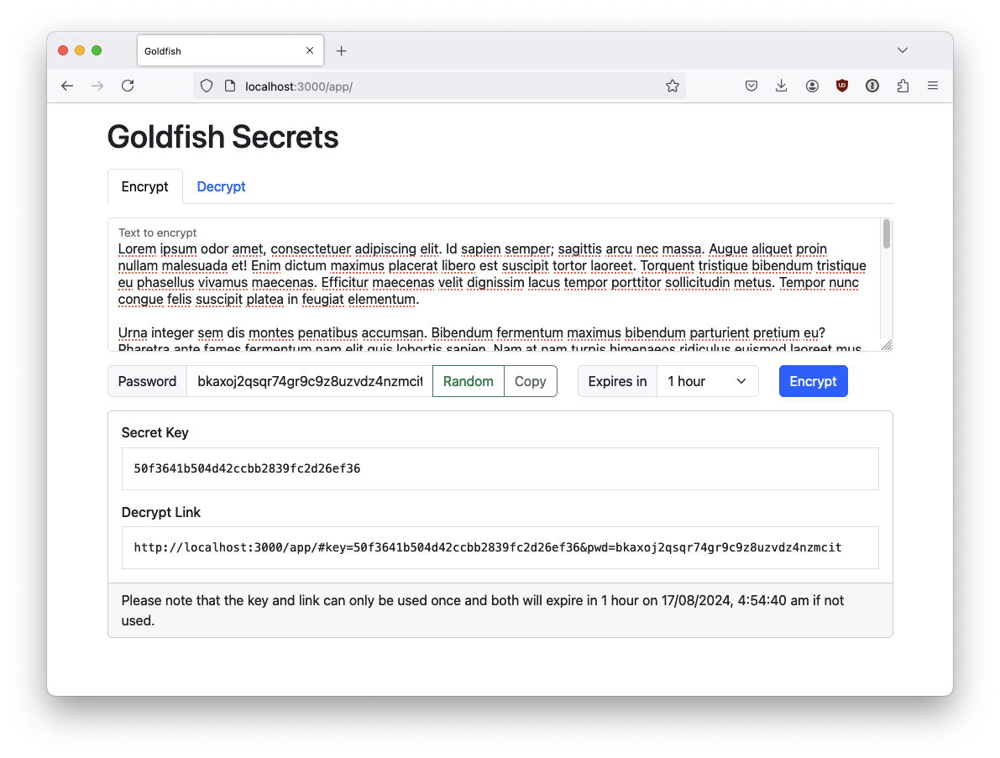
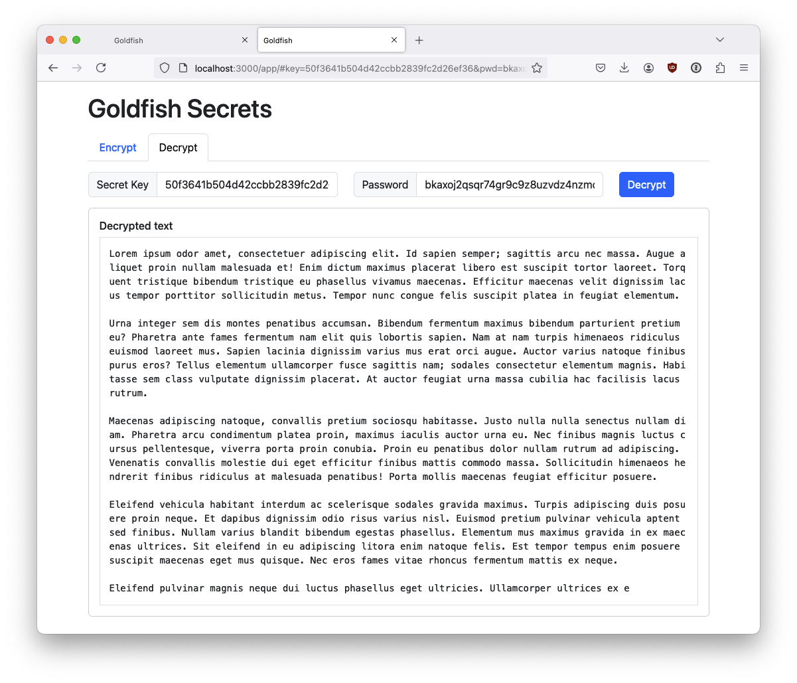

# Goldfish Secrets

Browser-based single-use sharing of secrets, using a server-local SQLite database, or a remote Redis server, to store browser-encrypted secrets.

Running precommit:
```
make precommit
```

Running locally in production mode, using embedded `app` assets:
```
make run
```

Running locally in development mode, using `app` assets directly from the filesystem:
```
make dev
```

Configuration options (command-line flags and environment variables):
```
$> /app/goldfish -h
NAME:
   goldfish - Webapp for browser-based one-time secret management

USAGE:
   goldfish [global options]  

GLOBAL OPTIONS:
   --help, -h     show help
   --version, -v  print the version

   Application

   --addr value           Server listen address (default: ":3000") [$LISTEN_ADDR]
   --backend storage      Backend to use for secret storage, either "sqlite" or "redis" (default: "sqlite") [$BACKEND_STORE]
   --breaker-ratio value  Circuit-breaker failure ratio; zero or less to disable the circuit-breaker (default: 0.1) [$BREAKER_RATIO]
   --pid-file path        PID file path; use "skip" to disable file creation (default: "/app/goldfish.pid") [$PID_FILE]

   CSRF protection

   --csrf-key value  CSRF cookie key; a random key will be used if not provided [$CSRF_KEY]
   --csrf-secure     Set to "true" when running with HTTPS (default: false) [$CSRF_SECURE]

   HTTPS listener

   --tls-cert file  Server TLS certificate file path [$TLS_CERT_FILE]
   --tls-key file   Server TLS private key file path [$TLS_KEY_FILE]

   Logging

   --log-format value    Structured log format, one of "plain", "text", or "json" (default: "plain") [$LOG_FORMAT]
   --log-level severity  Log severity level, one of "debug", "info", "warn", or "error" (default: "info") [$LOG_LEVEL]

   Rate-limiter

   --limit-count number  Maximum number of requests, per IP; zero to disable the limiter (default: 1000) [$RATE_LIMIT_COUNT]
   --limit-headers list  Comma-separated list of http request headers that can provide an IP address [$RATE_LIMIT_HEADERS]
   --limit-period time   Window of time for requests, per IP (default: 1h0m0s) [$RATE_LIMIT_PERIOD]

   Redis backend

   --redis-addr value  Redis address (default: "localhost:6379") [$REDIS_ADDR]
   --redis-db number   Redis db number, if required (default: 0) [$REDIS_DB]
   --redis-ns value    Redis namespace, if required [$REDIS_NS]
   --redis-pass value  Redis password, if required [$REDIS_PASS]
   --redis-tls value   Either "off", "on", or "insecure" (default: "off") [$REDIS_TLS]
   --redis-user value  Redis username, if required [$REDIS_USER]

   SQLite backend

   --sqlite-clean value  Interval for removal of unaccessed expired secrets (default: 1h0m0s) [$SQLITE_CLEAN]
   --sqlite-file path    Database file path (default: "/app/goldfish.db") [$SQLITE_FILE]
```

## Screenshots




